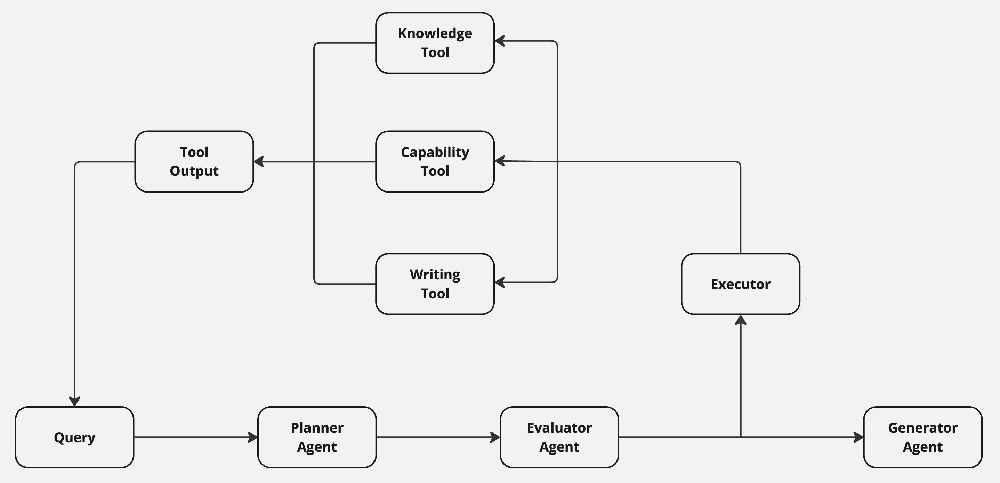

# AI Agents from Scratch

Modern LLMs are incredibly powerful, but on their own they lack memory, tool use, and the ability to interact with the world. To build real-world applications—like automated customer support—you need agents: systems that reason, take actions, and make decisions over time.

This notebook series walks through the process of building **agentic AI systems from scratch**, without relying on Agent Frameworks. By the end, you'll have a fully functioning multi-agent customer support system that retrieves company knowledge, reasons over customer data, and even simulates actions like refunds and cancellations.

We start simple—with a single prompted LLM—and incrementally layer in tools and logic. Each notebook introduces new agentic capabilities, culminating in a system that plans, retrieves, computes, and acts like a real support agent.

---

## Final Architecture

Here's what we'll build by the end of this series:

---

## What You'll Learn

- How to structure and evaluate AI agents step-by-step
- How to build your own tool calling + planner loop
- How to simulate a real-world customer support system (even without backend integrations)

## 🧠 Notebook Series

### `01_monolithic_llm.ipynb`
- Prompt-based system without tools

### `02_knowledge_tool.ipynb`
- Pulls return policies using a `get_return_policy` tool

### `03_capability_tool.ipynb`
- Adds `calculate_days_since_order` to decide refund eligibility

### `04_write_tools.ipynb`
- Adds `initiate_refund` to simulate a refund action. 

## 🔄 Feedback Welcome

This project is open for feedback, suggestions, and contributions.  
Feel free to fork it, use the eval set for your own agents, or adapt the ideas to your domain.

Let’s build. 